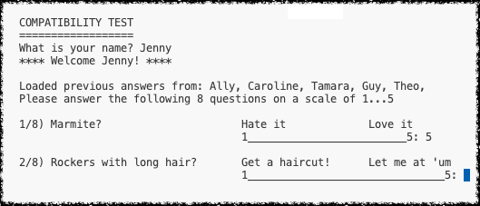

# User Input

A basic terminal-based dialogue with the user.

The user is asked a series of questions. 
Their answers are then compared against those of other users to find the best match.

Keywords: `dictionary` `enumeration` `list` `input` `print` 

## questionnaire1.py

Ask the user a series of questions.

1. create a dictionary of questions and possible answers
2. ask for the user's name
3. ask each question in turn
4. record the user's responses in a list
5. summarise all of the answers

The code contains two versions of the step 3. 
The more sophisticated version formats the output to make it look prettier.

## questionnaire2.py

Same as above but load and store the answers in a file.

This example uses functions defined in the previous one via Python's import mechanism. 
This avoids having to copy/paste code between files and keeps things tidy.

Keywords: `exceptions` `open` `read` `write` `json`

## questionnaire3.py

As above but compare the user's input against previous answers to find the best match.

Keywords: `best batch`
