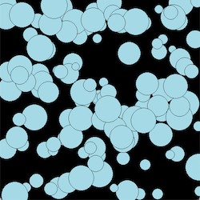
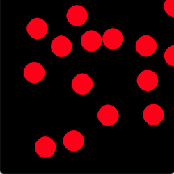
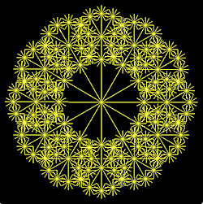
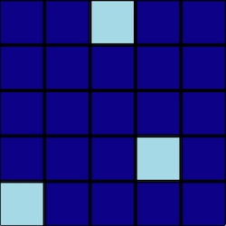

# Graphics
Simple examples of 2D graphics using pygame.

Each example includes functions defined in the previous one via Python's import mechanism. That way, we don't need to keep copy/pasting code into each.

- [Circles](#circles)
- [Bouncing Balls](#bouncing-balls)
- [Starburst](#starburst)
- [Hop-Scotch](#hop-scotch)

# Circles

Three examples based around painting circles. 



Keywords: `circle` `lists` `tuple` `mouse` `time` `random`

## circles1.py
Paint circles at random positions with a short delay between each

## circles2.py
Paint 10 random circles and then erase each one while you continue painting new ones. 
This means you have to remember where each one is! 

- Draw a circle and add it's coordinate to the end of a list
- Erase the circle whose coordinate is at the start of the list
- Delete the first item from the list
- Repeat...

## circles3.py
Paint circles at the current mouse position and then remove each one once it has been on-screen for more than 2 seconds.

- Draw a circle and add it's coordinate and time of drawing to the end of a list
- Erase the circle at the start of the list only if it was drawn was more than 2 seconds ago
- Delete the first item from the list
- Repeat...

# Bouncing Balls
Demonstrates how to simulate a ball bouncing off the sides of the screen.



Keywords: `circle` `lists` `random`

## bouncing_ball1.py

Animate a ball bouncing around the screen.

## bouncing_ball2.py

Adds sound for the bounce and simulate the effect of gravity on the ball.

## bouncing_ball3.py

Animate multiple balls at once. No sound this time since it could be a bit annoying!

## Exercises
- Modify **bouncing_ball3.py** to give each ball it's own colour.
- Remove each ball from the screen once it stops bouncing.


# Starbust / Flower

Simple 2D graphics using straight lines and recursion.

Keywords: `line` `sin` `cos` `radians`



## starburst1.py

Draws a simple fan of yellow lines from a centre-point outwards in a circle.
Wait for keypress, then draw a slightly different image in which the radius of the fan decreases as it rotates.

## starburst2.py

Demonstrates the use of simple **recursion** to achieve a complex result. Recursion is when a function calls itself and is a very powerful technique but can be a bit tricky to debug.

Keywords: `recursion` `call-depth`

- call the function `recursive_starburst()` to draw a fan centre: `(x,y)`, radius: `r`
- at the end of each line drawn, the function calls itself using the end-point as the centre of a new, smaller starburst
- we have to keep track of the call-depth to avoid going infinitely recursive. i.e. once the depth has reach 3, it doesn't bother calling itself any further.

## Exercises
- Modify **starburst1** so that it draws the fan from 0+N..360+N where N is a value that gradually increases. Hint: only call pygame.display.update() after drawing the entire fan and add a delay after each update.
- Modify **startburst2** to start at depth 1 and gradually increase the depth and radius. Try also changing the number of lines in each fan by altering the increment in: `for angle in range(0, 360, 30):`
- Modify **starburst2** to draw something that looks like a tree with branches, rather than a fan. Change the line thickness so that it starts thick and gets thinner for each branch. Also change the colour of the final branches to green, to look like leaves.

# Hop-Scotch

The basis of a game in which the user clicks on "flipped" squares in a grid to un-flip them.

Keywords: `nested lists` `random` `events`




## hop_scotch1.py
The program implements a function to construct an NxM grid of rectangles (pygame.Rect) using nested lists. 

For example, a 2x2 grid would be returned as:

```
[
    [cell1 cell2] 
    [cell3 cell4]
]
```
     
Access cell2 using: `grid[0][1]`

This grid structure is passed to a separate function which draws it in the game window.

- create grid
- draw grid

## hop_scotch2.py
This adds a function to "flip" random cells in the grid. 

Previously each cell was a pygame.Rect object. 
Here we modify the code to give each cell a Boolean flag - True/False to record if a cell is flipped or un-flipped.

For example, to access the flag of cell3 (in a 2x2 grid):

```
row = grid[1]
cell = row[0]
status = cell[1]
```
The draw function then draws these flipped cells in a different colour.

- create grid
- randomly flip some cells
- draw grid
- repeat...

## hop_scotch3.py

The final example waits for mouse-clicks and determines if the user has clicked on a flipped cell.

- create grid
- randomly flip some cells
- draw grid
- clicked on a flipped cell?
	- Yes: un-flip the cell, redraw, update the flipped count
	- No: make a failure sound
- repeat while flipped cells remain

## Exercises

- Show then hide the flipped cells so the player has to remember which ones were flipped. Hint: use `copy.deepcopy()` to make a copy of the grid in it's flipped state. Check mouse-clicks against the copy but pass the original grid to the draw function.
- Let the player see the cells as they are being flipped then insist that they are un-flipped in the correct order. Hint: modify the flip function so that it passes back a list of flipped cells. Then only check the mouse position against the first cell in that list.
- If the user correctly flips all the cells, either increase the number to be flipped next time or increase the grid-size or both!